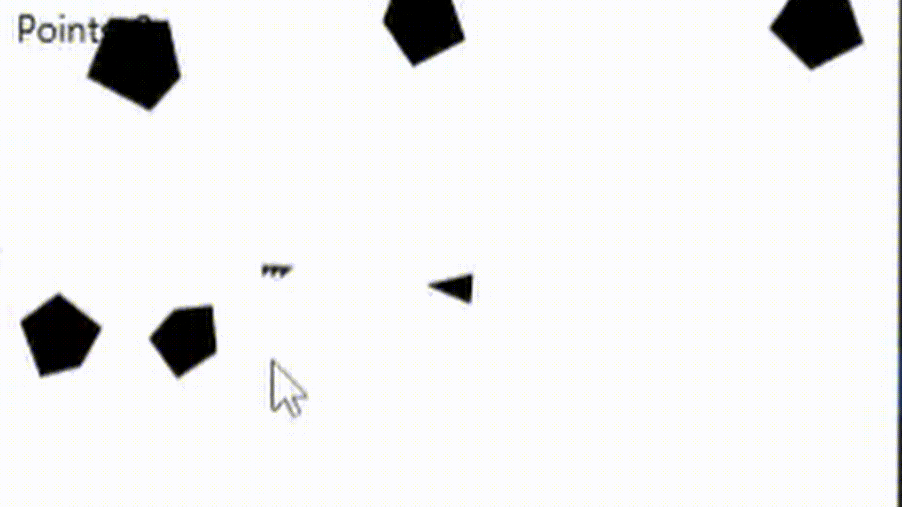

<div align="center">
  
  [](README.md)

</div>

# 2D Space Shooter Engine (Asteroids Clone)

Um motor de jogo 2D de alta performance desenvolvido em **Java puro**, recriando a mecânica clássica do "Asteroids".

O objetivo deste projeto não foi apenas criar um jogo, mas **implementar um sistema de física vetorial do zero**, estudando conceitos fundamentais de computação gráfica, álgebra linear e gerenciamento de memória em aplicações de tempo real.



## Engenharia & Matemática

Diferente de jogos feitos em engines comerciais (Unity/Godot), toda a lógica física e de renderização foi implementada manualmente:

* **Física Vetorial Customizada:** Implementação manual de vetores para cálculo de velocidade, aceleração, inércia e rotação angular. Nada de bibliotecas de física prontas.
* **Detecção de Colisão:** Algoritmos baseados em geometria (polígonos) para detectar interações entre a nave, asteroides e projéteis.
* **Game Loop Ativo:** Utilização do `AnimationTimer` do JavaFX para criar um loop de renderização estável a 60 FPS, desacoplando a lógica de atualização (Update) da lógica de desenho (Draw).
* **Design Orientado a Objetos:** Uso intenso de Polimorfismo para gerenciar o ciclo de vida das entidades do jogo (Inimigos, Jogador, Projéteis).

## Tecnologias

* **Java 21** (Linguagem base)
* **JavaFX 21** (Renderização Gráfica e Input de Teclado)
* **Design Patterns:** Game Loop, Component Pattern.

## Funcionalidades

* **Movimentação Newtoniana:** A nave possui inércia e aceleração, simulando movimento no vácuo.
* **Sistema de Partículas:** (Se tiver explosão, mantenha, se não, apague).
* **Mecânica de Wrap-around:** Entidades que saem de um lado da tela reaparecem no oposto (cálculo modular de coordenadas).
* **Dificuldade Progressiva:** Aumento gradual da complexidade conforme o tempo.

## Como rodar o projeto

### Pré-requisitos
* Java JDK 21 instalado.
* IDE (IntelliJ IDEA ou Eclipse) configurada com JavaFX.

### Passos
1.  Clone o repositório:
    ```bash
    git clone https://github.com/cgmarquess/Asteroid-Game.git
    ```
2.  Abra o projeto na sua IDE.
3.  Localize a classe principal e configure o metodo de execução.
4.  Execute o método `main`.

Desenvolvido por [Gabriel Marques] - [[LinkedIn](https://www.linkedin.com/in/cgmarquess/)]
